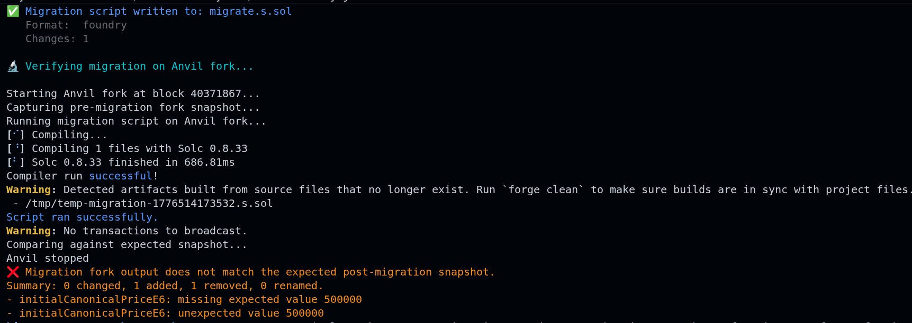

# Contributing to SlotProbe

First off — thank you for being here. SlotProbe is a small but technical project and every contribution, from fixing a typo to implementing a new storage type handler, makes it meaningfully better.

This guide is designed to take you from "I just cloned the repo" to "I can ship a quality PR" in a structured way. **Don't skip the learning path — the codebase has real complexity and the layers matter.**

---

## Table of Contents

- [Code of Conduct](#code-of-conduct)
- [Ways to Contribute](#ways-to-contribute)
- [Prerequisites](#prerequisites)
- [Development Setup](#development-setup)
- [Learning the Codebase — 4-Layer Path](#learning-the-codebase--4-layer-path)
  - [Layer 1: Foundation](#layer-1-foundation--start-here)
  - [Layer 2: The Brain](#layer-2-the-brain)
  - [Layer 3: Downstream Consumers](#layer-3-downstream-consumers)
  - [Layer 4: CLI & Output](#layer-4-cli--output)
- [File-by-File Reference](#file-by-file-reference)
- [Writing Tests](#writing-tests)
- [Pull Request Process](#pull-request-process)
- [Code Standards](#code-standards)
- [Responsible Disclosure](#responsible-disclosure)

---

## Code of Conduct

Be direct. Be technical. Be kind. We don't have a lengthy CoC document — just don't be a jerk, and focus on the code.

---

## Ways to Contribute

| Type | Examples |
|------|---------|
| 🐛 **Bug reports** | Wrong decoded value, incorrect slot calculation, CLI crash |
| ✨ **New features** | New storage type support, new chain, new output format |
| 📝 **Documentation** | Improve examples, fix typos, add NatSpec to undocumented functions |
| 🧪 **Tests** | Add unit tests for edge cases, improve integration test coverage |
| 🔧 **Tooling** | CI improvements, build improvements |

**Good first issues** are tagged [`good first issue`](https://github.com/0xHimxa/SlotProbe/issues?q=is%3Aissue+is%3Aopen+label%3A%22good+first+issue%22) on GitHub.

---

## Prerequisites

Before diving in, you need a solid understanding of:

- **TypeScript** — generics, async/await, `bigint` arithmetic
- **EVM Storage Layout** — [read the Solidity docs first](https://docs.soliditylang.org/en/latest/internals/layout_in_storage.html)
- **keccak256 slot derivation** for mappings and dynamic arrays (covered in the Solidity docs above)
- **Foundry basics** — specifically `forge build` output and `anvil` for local EVM forks

> 💡 **Tip:** If EVM storage is new to you, do this exercise before reading any code: open a verified contract on Etherscan, manually calculate the slot for a mapping entry using keccak256, and verify it with `cast storage`. This hands-on exercise is worth more than reading 10 articles.

---

## Development Setup

```bash
# 1. Fork and clone
git clone https://github.com/YOUR_USERNAME/SlotProbe.git
cd SlotProbe

# 2. Install dependencies
npm install

# 3. Run the test suite — everything should pass on a clean clone
npx vitest run

# 4. Build the CLI
npm run build

# 5. Try the built CLI
node dist/cli/index.js --help
```

### Config (Optional)

```bash
cp .SlotProberc.example.json slotprobe.config.json
# Edit slotprobe.config.json and add your RPC URLs
```

---

## Learning the Codebase — 4-Layer Path

SlotProbe has a clear dependency hierarchy. **Read layers in order** — each one builds on the previous.

```
Layer 4: CLI & Output          (commander, chalk, formatters)
              ↑
Layer 3: Downstream Consumers  (snapshot, diff, collision, migration)
              ↑
Layer 2: The Brain             (storage engine, artifact parser)
              ↑
Layer 1: Foundation            (config, RPC client, retry, batch)
```

For each file, follow this **three-step method**:

1. **Read the module docstring** at the top (`/** @module */`) — it explains what the module does and how it fits in the system.
2. **Plug in real values** — create a `scratch.ts` and run it with `npx tsx scratch.ts`. Don't just read; run.
3. **Write a test** — the fastest way to confirm understanding is to add a test case. See the `src/test/unit/` directory for patterns.

---

### Layer 1: Foundation — Start Here

These files have **zero dependencies on other SlotProbe code**. They only use external libraries (`viem`, `zod`, `p-limit`, `p-retry`). Start here.

| # | File | What It Does | Time |
|---|------|-------------|------|
| 1 | [`src/config/schema.ts`](src/config/schema.ts) | Zod schema for `.SlotProberc.json`. Defines the shape of all runtime config. | 5 min |
| 2 | [`src/config/loader.ts`](src/config/loader.ts) | Discovers and loads config from disk. Has an in-process cache so repeated calls don't hit the filesystem. | 10 min |
| 3 | [`src/rpc/client.ts`](src/rpc/client.ts) | Creates `viem` public clients per chain. This is how SlotProbe talks to the blockchain. | 5 min |
| 4 | [`src/rpc/retry.ts`](src/rpc/retry.ts) | Wraps RPC calls with exponential backoff. Understands which HTTP errors are retryable (429, 5xx, timeouts). | 5 min |
| 5 | [`src/rpc/batch.ts`](src/rpc/batch.ts) | Concurrency limiter using `p-limit`. Prevents flooding the RPC provider with too many parallel requests. | 5 min |
| 6 | [`src/rpc/chains.ts`](src/rpc/chains.ts) | Chain metadata (names, IDs, explorer URLs). Used by the CLI display layer. | 3 min |

**✅ Exercise — Fetch a Raw Storage Slot**

```typescript
// scratch.ts — run with: npx tsx scratch.ts
import { getClient } from './src/rpc/client.js'

const client = getClient('mainnet')
const slot0 = await client.getStorageAt({
  address: '0xA0b86991c6218b36c1d19D4a2e9Eb0cE3606eB48', // USDC
  slot: '0x0000000000000000000000000000000000000000000000000000000000000000',
})
console.log('USDC slot 0:', slot0)
// → a 66-char hex string (0x + 64 hex digits = 32 raw bytes)
// Everything in SlotProbe starts from this primitive.
```

---

### Layer 2: The Brain

These modules implement the core EVM storage logic — slot math, type decoding, and artifact parsing. **This is where the real complexity lives.**

| # | File | What It Does | Time |
|---|------|-------------|------|
| 7 | [`src/core/storage-engine/slot-calculator.ts`](src/core/storage-engine/slot-calculator.ts) | **Hardest file in the codebase.** keccak256 slot derivation for mappings, dynamic arrays, nested mappings, and structs. Also handles mapping key encoding/decoding for all Solidity types. | 30 min |
| 8 | [`src/core/storage-engine/decoder.ts`](src/core/storage-engine/decoder.ts) | Converts raw hex to typed Solidity values: `bool`, `uint/int` (all widths), `address`, fixed `bytes`, dynamic `bytes`/`string` (short form). | 15 min |
| 9 | [`src/core/storage-engine/packed.ts`](src/core/storage-engine/packed.ts) | Solidity packs multiple small variables into one 32-byte slot. This module extracts individual values by byte offset and size. Variables pack from the right (low bytes). | 10 min |
| 10 | [`src/core/storage-engine/reader.ts`](src/core/storage-engine/reader.ts) | High-level wrapper over `eth_getStorageAt` with retry and batch support. `readSlot` for one, `readSlots` for many with deduplication. | 10 min |
| 11 | [`src/core/artifact-parser/types.ts`](src/core/artifact-parser/types.ts) | The unified `StorageLayout` schema. Every downstream module works with this shape. Includes `StorageVariable`, `TypeInfo`, and raw Foundry interfaces. | 10 min |
| 12 | [`src/core/artifact-parser/foundry.ts`](src/core/artifact-parser/foundry.ts) | Parses Foundry `forge build` JSON artifacts. Normalises string slots → `bigint`, string byte counts → `number`. | 10 min |
| 13 | [`src/core/artifact-parser/hardhat.ts`](src/core/artifact-parser/hardhat.ts) | Same as the Foundry parser but for Hardhat artifact format. | 5 min |
| 14 | [`src/core/artifact-parser/normalizer.ts`](src/core/artifact-parser/normalizer.ts) | Auto-detects Foundry vs Hardhat from JSON structure and delegates to the right parser. Also provides `validateArtifact` for early error reporting. | 5 min |

**✅ Exercise — Trace a Mapping Slot Calculation**

```typescript
import { mappingSlot } from './src/core/storage-engine/slot-calculator.js'

// For mapping(address => uint256) at storage slot 5
const slot = mappingSlot('0xd8dA6BF26964aF9D7eEd9e03E53415D37aA96045', 5n)
console.log('Derived slot:', '0x' + slot.toString(16))
// Verify independently: cast storage <contract> <derived-slot-hex>
```

**✅ Exercise — Decode a Raw Hex Value**

```typescript
import { decodeValue } from './src/core/storage-engine/decoder.js'

console.log(decodeValue('0x' + '0'.repeat(62) + '64', 't_uint256'))   // → '100'
console.log(decodeValue('0x' + '0'.repeat(63) + '1',  't_bool'))      // → true
console.log(decodeValue(
  '0x000000000000000000000000d8da6bf26964af9d7eed9e03e53415d37aa96045',
  't_address'
))  // → '0xd8da6bf26964af9d7eed9e03e53415d37aa96045'
```

**✅ Exercise — Parse a Real Artifact**

```typescript
import { parseArtifact } from './src/core/artifact-parser/normalizer.js'

// Point at any Foundry build artifact (run `forge build` first)
const layout = parseArtifact('./out/MyContract.sol/MyContract.json')
console.log('Contract:', layout.contractName)
console.log('Variables:', layout.variables.map(v => `${v.label} @ slot ${v.slot}`))
```

---

### Layer 3: Downstream Consumers

These modules **consume** the storage engine and artifact parser to do useful things. **Start with `capture.ts` — it's the heart of SlotProbe.**

| # | File | What It Does | Time |
|---|------|-------------|------|
| 15 | [`src/core/snapshot/types.ts`](src/core/snapshot/types.ts) | `Snapshot` and `SnapshotEntry` Zod schemas. A snapshot is named variables with decoded values at a specific block. | 5 min |
| 16 | [`src/core/snapshot/filter.ts`](src/core/snapshot/filter.ts) | `--only` flag implementation — filters a storage layout to specific variable names. Also provides `groupBySlot` for packed-slot analysis. | 5 min |
| 17 | [`src/core/snapshot/mapping-keys.ts`](src/core/snapshot/mapping-keys.ts) | Loads user-supplied mapping key files (JSON). Mappings can't be enumerated on-chain, so users provide the keys they care about. | 5 min |
| 18 | [`src/core/snapshot/store.ts`](src/core/snapshot/store.ts) | Serialises/deserialises snapshots to JSON with bigint-safe encoding (`__bigint__` marker pattern). | 5 min |
| 19 | [`src/core/snapshot/storage-decode.ts`](src/core/snapshot/storage-decode.ts) | Solidity's two-phase bytes/string storage — short (inline, ≤31 bytes) vs long (out-of-line at `keccak256(slot)`). | 10 min |
| 20 | [`src/core/snapshot/capture-helpers.ts`](src/core/snapshot/capture-helpers.ts) | Pure utility functions extracted from `capture.ts`: mapping slot calculation, packed-value detection, fixed-array detection, type lookups. | 10 min |
| 21 | ⭐ [`src/core/snapshot/capture.ts`](src/core/snapshot/capture.ts) | **THE HEART OF SLOTPROBE** — The full capture pipeline. Recursive dispatch, I/O batching, dry-run estimation. Read the §1–§7 section headers to navigate. | 45 min |
| 22 | [`src/core/diff/types.ts`](src/core/diff/types.ts) | `DiffEntry`, `DiffResult`, `DiffStatus` — the diff output shape. | 3 min |
| 23 | [`src/core/diff/engine.ts`](src/core/diff/engine.ts) | Compares two snapshots by variable name. Produces changed/added/removed/unchanged entries. | 10 min |
| 24 | [`src/core/diff/semantic.ts`](src/core/diff/semantic.ts) | Formatting helpers — summary strings, change overviews, entry formatting. | 5 min |
| 25 | [`src/core/collision/proxy-handler.ts`](src/core/collision/proxy-handler.ts) | Knows about EIP-1967/Transparent/UUPS proxy reserved slots. Filters them from collision checks. | 5 min |
| 26 | [`src/core/collision/detector.ts`](src/core/collision/detector.ts) | Flattens both storage layouts into byte-addressable fields, then checks for byte-range overlap. Tracks comparison "regions" so mapping internals don't false-positive against root slots. | 20 min |
| 27 | [`src/core/collision/report.ts`](src/core/collision/report.ts) | Formats collision results for terminal and Markdown output. | 5 min |
| 28 | [`src/core/migration/generator.ts`](src/core/migration/generator.ts) | Generates Foundry/Hardhat migration scripts from diff entries using Handlebars templates. | 10 min |
| 29 | [`src/core/migration/verifier.ts`](src/core/migration/verifier.ts) | The `--verify` flow: spawns Anvil, runs the migration, re-captures state, and diffs against the expected snapshot. | 15 min |

#### 🔍 Deep Dive: `capture.ts`

`capture.ts` is organised into 7 numbered sections — read them in order:

| Section | What It Does |
|---------|-------------|
| **§1 — Public Interfaces** | `CaptureOptions` and `CaptureResult` — the inputs/outputs of the pipeline |
| **§2 — Public Entry Points** | `captureSnapshot()` (full capture) and `dryRunCapture()` (estimation only) |
| **§3 — Internal Context Types** | `CaptureContext` and `CaptureVariableInput` — the "work item" flowing through every recursive call |
| **§4 — Recursive Dispatch** | `captureVariableEntries()` — the central dispatcher routing each variable to its handler: leaf, struct, dynamic array, fixed array, or mapping |
| **§5 — Slot I/O Layer** | `getSlotValue/getSlotValues/flushQueuedSlots` — cache dedup + batch queue so the same slot is never read twice |
| **§6 — Helper Utilities** | Placeholder entries for unexpandable mappings |
| **§7 — Dry-Run Engine** | Mirrors the dispatch logic but only counts slots instead of reading them |

**The recursion model:**

```
captureSnapshot()
  → captureVariableEntries(topLevelVar)      ← dispatch
    → captureStructEntries(struct)            ← struct members
      → captureVariableEntries(member)        ← recurse
        → captureLeafEntry(scalar)            ← terminal case
    → captureDynamicArrayEntries(array)
      → captureVariableEntries(element)       ← recurse per element
    → captureMappingEntries(mapping)
      → captureVariableEntries(value)         ← recurse per key
```

Each recursive call carries a `CaptureVariableInput` with the current **path** (`"config.fee"`, `"balances[0xdead...]"`), **base slot**, and **sibling variables** (for packed-slot detection).

---

### Layer 4: CLI & Output

The final layer wires everything into a polished command-line experience.

| # | File | What It Does | Time |
|---|------|-------------|------|
| 30 | [`src/cli/index.ts`](src/cli/index.ts) | Entry point. Creates the Commander program and registers all 4 subcommands. | 3 min |
| 31 | [`src/cli/commands/snapshot.ts`](src/cli/commands/snapshot.ts) | `slotprobe snapshot <address>` — wires CLI flags to `captureSnapshot()` | 10 min |
| 32 | [`src/cli/commands/diff.ts`](src/cli/commands/diff.ts) | `slotprobe diff <before> <after>` — loads two snapshots and runs `diffSnapshots()` | 10 min |
| 33 | [`src/cli/commands/check-collision.ts`](src/cli/commands/check-collision.ts) | `slotprobe check-collision <old> <new>` — parses two artifacts and runs `detectCollisions()` | 10 min |
| 34 | [`src/cli/commands/generate-migration.ts`](src/cli/commands/generate-migration.ts) | `slotprobe generate-migration <before> <after>` — generates and optionally verifies migration scripts | 10 min |
| 35 | [`src/cli/formatters/terminal.ts`](src/cli/formatters/terminal.ts) | Chalk-coloured diff output for the terminal | 5 min |
| 36 | [`src/cli/formatters/markdown.ts`](src/cli/formatters/markdown.ts) | Markdown table output for GitHub PRs | 5 min |
| 37 | [`src/cli/formatters/json.ts`](src/cli/formatters/json.ts) | JSON output for CI/scripting | 5 min |

---

## File-by-File Reference

A complete map of every file in the codebase.

### Config (`src/config/`)

| File | Purpose |
|------|---------|
| `schema.ts` | Zod schema for `.SlotProberc.json`, default values |
| `loader.ts` | Config discovery, loading, caching, merging |
| `index.ts` | Barrel re-export |

### RPC (`src/rpc/`)

| File | Purpose |
|------|---------|
| `client.ts` | Viem public client factory with multicall batching |
| `retry.ts` | `withRetry()` — exponential backoff with `p-retry` |
| `batch.ts` | `createBatcher()` — concurrency limiter with `p-limit` |
| `chains.ts` | Chain metadata (names, IDs, explorer URLs) |
| `index.ts` | Barrel re-export |

### Storage Engine (`src/core/storage-engine/`)

| File | Purpose |
|------|---------|
| `slot-calculator.ts` | keccak256 slot math for mappings, arrays, structs |
| `decoder.ts` | Raw hex → typed Solidity value |
| `packed.ts` | Extract individual values from packed 32-byte slots |
| `reader.ts` | `readSlot()` / `readSlots()` — RPC wrappers with dedup |
| `index.ts` | Barrel re-export |

### Artifact Parser (`src/core/artifact-parser/`)

| File | Purpose |
|------|---------|
| `types.ts` | `StorageLayout`, `StorageVariable`, `TypeInfo` schemas |
| `foundry.ts` | Parse Foundry `forge build` artifacts |
| `hardhat.ts` | Parse Hardhat artifacts |
| `normalizer.ts` | Auto-detect format + `parseArtifact()` entry point |
| `index.ts` | Barrel re-export |

### Snapshot (`src/core/snapshot/`)

| File | Purpose |
|------|---------|
| ⭐ `capture.ts` | Core capture pipeline — recursive dispatch, I/O batching |
| `capture-helpers.ts` | Pure helpers: mapping slot calc, type lookups |
| `storage-decode.ts` | Dynamic bytes/string short-form + long-form decoding |
| `filter.ts` | `--only` flag + `groupBySlot` |
| `store.ts` | Save/load snapshots with bigint-safe JSON serialization |
| `mapping-keys.ts` | Load + validate user-supplied mapping key files |
| `types.ts` | `Snapshot`, `SnapshotEntry` Zod schemas |
| `index.ts` | Barrel re-export |

### Diff, Collision, Migration

| Module | Key Files |
|--------|-----------|
| **Diff** (`src/core/diff/`) | `engine.ts` — variable-name-level comparison; `types.ts` — `DiffResult`; `semantic.ts` — formatting |
| **Collision** (`src/core/collision/`) | `detector.ts` — byte-range overlap; `proxy-handler.ts` — EIP-1967 reserved slots; `report.ts` — formatting |
| **Migration** (`src/core/migration/`) | `generator.ts` — Handlebars script generation; `verifier.ts` — Anvil fork verification; `templates/` — `.hbs` files |

---

## Writing Tests

Tests live in `src/test/`:

```
src/test/
├── unit/             # Pure function tests — no network, no filesystem
└── integration/      # May spawn Anvil, read real chain state
```

**Rules:**
- Unit tests mock external dependencies (RPC, filesystem)
- Integration tests pin to a specific block number for determinism
- Use `describe/it/expect` from `vitest` (configured globally)
- Test filenames must end with `.test.ts`

**Example unit test:**

```typescript
import { describe, it, expect } from 'vitest'
import { mappingSlot } from '../../core/storage-engine/slot-calculator.js'

describe('mappingSlot', () => {
  it('produces a deterministic slot from key + baseSlot', () => {
    const s1 = mappingSlot('0xd8dA6BF26964aF9D7eEd9e03E53415D37aA96045', 0n)
    const s2 = mappingSlot('0xd8dA6BF26964aF9D7eEd9e03E53415D37aA96045', 0n)
    expect(s1).toBe(s2) // deterministic

    const s3 = mappingSlot('0xd8dA6BF26964aF9D7eEd9e03E53415D37aA96045', 1n)
    expect(s3).not.toBe(s1) // different base slot → different result
  })
})
```

**Run tests:**

```bash
npx vitest run                          # all tests, once
npx vitest                              # watch mode
npx vitest run src/test/unit/decoder.test.ts   # specific file
npx vitest run --coverage               # with coverage
```

---

## Pull Request Process

1. **Fork** the repo and create a feature branch:
   ```bash
   git checkout -b feat/your-feature-name
   ```

2. **Write tests** for every behaviour you add or change. PRs without tests for new logic will be asked to add them.

3. **Make sure the suite passes:**
   ```bash
   npx vitest run
   ```

4. **Keep the commit history clean** — squash WIP commits before opening the PR.

5. **Open the PR** with:
   - A one-sentence summary of *what* changed
   - A short paragraph on *why* (what problem does this solve?)
   - A test plan — how did you verify it works?

6. **Small PRs merge faster.** If you're adding a big feature, open a draft PR early and ask for feedback before completing it.

---

## Code Standards

| Rule | Why |
|------|-----|
| Every file has a module-level `/** @module */` docstring | Navigation and contributor onboarding |
| Every exported function has `@param`, `@returns`, and `@example` | Self-documenting API |
| No `any` types — use `unknown` and narrow with type guards | Prevents silent bugs in EVM data handling |
| All slot numbers are `bigint` — never `number` | `number` overflows at slot > 2^53 |
| ESM imports use `.js` extension | TypeScript `nodenext` resolution requirement |
| Zod schemas are the single source of truth for data shapes | Runtime safety for untrusted RPC data |

---

## Responsible Disclosure

**If you find a real storage bug in a protocol while using SlotProbe:**

Please disclose it to the protocol team first, following their security disclosure process. Once the issue is resolved, we strongly encourage sharing your findings — the community gets stronger when tooling catches real bugs.

If you find a security vulnerability in SlotProbe itself, please open a [GitHub issue](https://github.com/0xHimxa/SlotProbe/issues) marked `security` or contact the maintainer directly.
